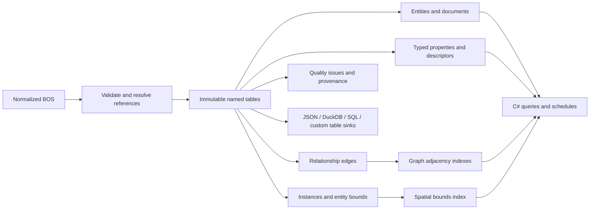

# BIM query model: current design and open decisions

This is a working design, informed by implementation and real data, rather than a schema we
declared complete before writing code. The new `Ara3D.BimOpenSchema.DataModel` project turns BOS
into an immutable, query-friendly snapshot. `Ara3D.BimOpenSchema.DataModel.IO` handles files and
database exports. Both target .NET 8; existing projects have not been rewritten.

## What this layer is for

BOS is a compact interchange representation: integers point into shared strings, descriptors,
entities, and geometry buffers. That is useful for storage, but every consumer otherwise has to
rediscover how to resolve those references, handle missing values, inherit type properties, or
transform geometry.

This layer does that work once. A tool should be able to ask “which walls have this property?”,
“what belongs to this assembly?”, or “which elements could overlap this region?” using named
fields and explicit query semantics. The same information should be usable in C#, SQL, and by
an agent reading a schema and examples.

It is a **read model**, not a model editor or a replacement interchange standard. Rebuilding a
snapshot is currently the way to incorporate changes. Its tables describe one source dataset,
which can itself contain multiple documents.

## The structure at a glance

The published snapshot contains these tables:

| Table | One row represents | Useful fields and purpose |
|---|---|---|
| ModelInfo | The source snapshot | Format version, source ID, source schema version, generator, geometry units, numeric unit policy |
| Documents | A source document | Document ID, title, path |
| Entities | A source entity, including type and category entities | Source row ID, snapshot key, local/global ID, document title, entity name, category name, type name, references to those entities |
| Descriptors | A source property definition | Original name, group, units, value kind, normalized comparison key |
| Properties | A source property assignment | Owning entity, descriptor, raw value/index, resolved typed value, validity/missing status, optional explicitly converted numeric value |
| Edges | A source or derived relationship | Source/target entity IDs, relationship kind, origin, source row ID |
| Instances | A valid geometry instance | Entity, source mesh/material IDs, hidden status, world bounds, triangle count |
| Geometry | The geometry summary of an entity | Union bounds, center, dimensions, bounds volume, instance count, triangle count, hidden-instance count |
| Issues | A data-quality observation or source diagnostic | Severity, code, original table/row, related entity, explanation |

Mesh and material IDs in `Instances` are provenance references into the input geometry. They are
not foreign keys to mesh or material tables in this snapshot. Full meshes, appearance data, and
transforms are not currently retained in the read model; retain BOS when downstream tools need them.

## How much denormalization?

Entities are deliberately wide for common questions: a category or document name does not require
a string-table join. Property rows likewise carry readable names, groups, units, and resolved values.
Geometry summaries are precomputed rather than reconstructed for each query.

There is **not one enormous table with a column for every property ever found**. Different models
have different descriptors, and identical names can describe different things. A universal wide
table would be sparse, unstable across files, and prone to silently mixing units or meanings.

Instead, properties remain a resolved, typed assignment table. A workflow selects its desired
columns through the schedule API, which produces entity rows with cells for those property keys.
Cells retain all matching values and their provenance. That makes a door schedule or equipment
register straightforward without forcing every tool to accept the same set of columns.

This is an intentional middle ground: common entity fields are denormalized; arbitrary properties
keep their identity; purpose-specific wide projections sit above them. Deciding which additional
fields deserve promotion into `Entities` should follow real workflow experience.

## Identity and provenance

Within a snapshot, an entity ID is its original zero-based BOS entity row. Document and descriptor
IDs also preserve their source rows. Property IDs preserve original parameter rows, so they can
have gaps when unusable assignments were excluded. Edge IDs are generated for the exported edge
table; their origin and source-row fields identify the original relation, entity, or property.

An entity key includes the caller's source ID and entity row. It remains unique even if the source
repeats a document/local-ID pair. Such duplicates are reported, not merged. These keys are **not
guaranteed stable across a fresh export that reorders rows**. Cross-version comparison should use
source/document identity plus local/global IDs and an explicit matching policy.

Federation is possible at the storage boundary by assigning distinct source IDs, but there is no
implemented merge API that remaps integer IDs across snapshots. A federated database must include
the source ID in its joins or remap IDs. We should design that contract before advertising an
automatic federation or model-diff feature.

## Property meaning and cleanup

A property's comparison identity is `(normalized name, normalized group, normalized units, kind)`.
Normalization uses Unicode compatibility normalization, whitespace cleanup, invariant case folding,
and a small explicit dictionary of unit-label aliases. Original labels and string values survive.

Integers, numbers, text, entity references, and 3D points have separate typed values. The model
distinguishes an absent value, an invalid reference, and a legitimate zero. BOS `-1` is treated as
missing for indexed value kinds; an integer value of `-1` remains the integer `-1`.

Duplicate assignments are retained and reported. The effective-property query follows the type
chain: a nearer instance assignment overrides a farther type assignment with the same complete
key. All duplicates at the winning level remain visible. An explicit missing instance assignment
also overrides its inherited counterpart. Cycles terminate through visited-node tracking.

Numeric conversion is conservative. Revit can store feet-based internal values while exposing a
different display-unit label. Therefore the default is to preserve the numeric value and label,
without claiming an SI conversion. A caller can explicitly confirm that values use their declared
units; only then are supported units converted into separate canonical-value columns. The original
numeric value remains available. Geometry has its own BOS metre-based contract.

Not yet implemented: configurable name dictionaries, organization-specific classification mapping,
locale-dependent text-to-number parsing, automatic unit inference, or semantic merging of elements.
These should be explicit policies with provenance, not invisible guesses in the converter.

## Graphs

Source relationships retain their BOS direction: for example, a child points to its parent for
`PartOf`, and an element points to its container for `ContainedIn`. Incoming traversal answers the
inverse question. `ConnectsTo` is treated as symmetric because BOS defines that meaning even when
only one direction is stored.

The graph also exposes derived `IsOfType`, `InCategory`, and `PropertyReference` edges. Their origin
distinguishes them from source relationships. Callers should normally filter by kind: a walk across
every relationship kind can answer a very different question from a containment walk.

Current operations are neighbors, bounded reachability, and unweighted shortest paths. They use
adjacency indexes, are deterministic, and terminate on cycles. There is no claimed weighted route
solver, MEP flow simulation, or full Cypher/SQL-PGQ implementation.

I considered using an external graph engine. For the first version, adjacency indexes cover the
in-process requirements without a service dependency. The exported edge table also supports DuckDB
recursive SQL; this was exercised in an integration test. DuckDB documents both
[recursive graph traversal](https://duckdb.org/docs/current/sql/query_syntax/with) and
[the optional DuckPGQ extension](https://duckdb.org/docs/current/guides/sql_features/graph_queries).
DuckPGQ currently has version requirements and documented algorithm limitations; it is not enabled
or installed by this project. QuikGraph is another possible algorithm library, but current operations
do not yet justify adding it. Revisit this when a concrete workflow requires pattern matching,
weighted paths, centrality, or other algorithms beyond the current API.

## Geometry and spatial queries

The converter decodes quantized BOS vertices into metres, applies scale, rotation and translation,
and computes world-space axis-aligned bounds. It transforms the actual vertices rather than only
the corners of a local bounding box. Repeated mesh/transform pairs reuse a computed result.
Multiple instances aggregate into an entity summary; hidden instances are included and counted.

A median-split bounding-volume hierarchy indexes entity bounds. It supports region intersection
and distance-from-point queries. Exact boundary contact is included. Bounds, centers, dimensions,
counts and bounds volume are also exported as ordinary SQL columns.

These are **candidate searches**, not exact geometry answers. A box overlap does not prove a clash;
a point close to an element's box may be far from its surface. Bounds volume is not concrete,
steel, room, or material quantity. Exact clash detection, ray picking, point-in-solid tests, room
containment, surface area, solid volume, and clearance checks need mesh/topology work after this
first filtering step. Hidden-only exclusion can currently be performed through instance data;
there is no separately indexed visible-only entity bound.

## Workflows considered

| Workflow in an architecture/engineering firm | Current support | What the consuming tool still supplies |
|---|---|---|
| Door, wall, equipment and room schedules | Entity/category filtering, effective type properties, selected schedule columns | Project-specific field selection, business labels, duplicate-value decisions |
| Data-quality and delivery audits | Missing-required-property queries, typed values, source references, invalid/duplicate diagnostics | Required-field rules, classification dictionaries, acceptance criteria |
| Model inventory and dashboard summaries | Counts by document/category, geometry coverage, SQL-ready rows | Discipline mapping and project reporting conventions |
| Assembly, host, level and room navigation | Typed directed graph traversal with inverse queries | Deciding which relationship kinds represent the desired domain hierarchy |
| MEP connectivity exploration | Symmetric connectivity and shortest unweighted paths | Connector semantics, costs, capacities, flow rules, completeness checks |
| Quantity takeoff preparation | Numeric property selection with explicit unit identity, entity grouping | Trusted quantity definitions, unit interpretation, exact mesh quantities where needed |
| Clash and clearance screening | World bounds and indexed candidate selection | Exact geometry tests and regulatory/business rules |
| Viewer selection and investigation | Category/property filtering, stable snapshot entity IDs, region queries | Rendering and original meshes/materials |
| Cross-model analytics | Source-tagged metadata, document/local/global identifiers, portable tables | Federation/remapping policy; correspondence across changing exports |
| Agent-assisted investigation | Named tables, explicit keys, typed values, diagnostics, compact query examples | Choosing the intended relation/property and acknowledging missing or ambiguous data |

## Storage, scale, and purity

The core has no file or database dependency. Published rows and indexes are immutable. Temporary
builders are local to conversion/query functions. Platonic.Core and all twelve Platonic analyzers
are enabled through the sibling Platonic.CSharp packages; IO is confined to explicitly marked
adapters. A negative build probe verifies that mutable code is rejected.

JSON stores the table snapshot and rebuilds indexes on load. DuckDB uses bulk appenders in a
transaction. SQL scripts are also supported and are integration-tested with SQLite. The generic
relational-table projection exposes named columns and reads rows on demand for other sinks.
Exports refuse to overwrite existing tables, with DuckDB rolling back a partially attempted export.
Primary keys are declared. Cross-table relationships are validated before indexing; SQL foreign-key
constraints are not currently emitted.

The snapshot is currently **in memory**. It does not provide lazy disk-backed properties, incremental
updates, database-side conversion, or an out-of-core geometry pipeline. Graph storage is linear in
edges, property indexes are linear in assignments, and spatial queries prune a hierarchy rather
than scanning every element. Category grouping and snapshot construction still read their inputs.

The end-to-end run passed on all 15 supplied samples, including legacy split parameter
tables and a geometry-only file whose orphan instances were reported. The largest hospital sample
had 492,658 entities, 18,204,541 property assignments, and 3,097,112 geometry instances. Its latest
conversion/index build took about 45 seconds on this workstation. That run allocated about 19.9 GiB
cumulatively across the managed heap; this is **not peak resident memory**. It demonstrates a useful
scale, but it is not a production capacity guarantee. The earlier run took about 70 seconds; elapsed
time varies with runtime and machine conditions. See the [validation record](../../tests/Ara3D.BimOpenSchema.DataModel.Tests/VALIDATION.md).

## What changed through dogfooding

1. Reading BOS showed that the existing convenience object model loses same-name properties. The
   new model resolves BOS directly and keeps descriptor identity and duplicates.
2. Sample inspection found both legacy split parameters and unified parameter tables. The new IO
   reader supports both and reads every Parquet row group without changing the older reader.
3. Geometry-only files forced a policy for orphan instances: report them instead of manufacturing
   entity identities or attaching them to an unrelated element.
4. Unit investigation ruled out default conversion from display labels alone.
5. Sample diagnostics exposed the need to distinguish `-1` missing values from bad references.
6. Large samples reinforced sharing immutable row objects, indexing common queries, caching repeated
   mesh/transform work, and projecting export rows on demand.

## Decisions to make next

The current implementation establishes a usable foundation, but the next schema choices should
come from a small number of representative firm workflows. I would prioritize a door/equipment
schedule, a model-delivery audit, an MEP connectivity investigation, and a clash-candidate report.
They exercise quite different needs without pretending that one universal BIM vocabulary exists.

The most consequential open questions are which domain fields to promote, how to configure
classification/unit dictionaries, whether to retain meshes for exact geometry, how to federate
snapshots, and when the in-memory property table should move behind a database-backed query API.
Those are design choices still to validate, not implemented capabilities.
